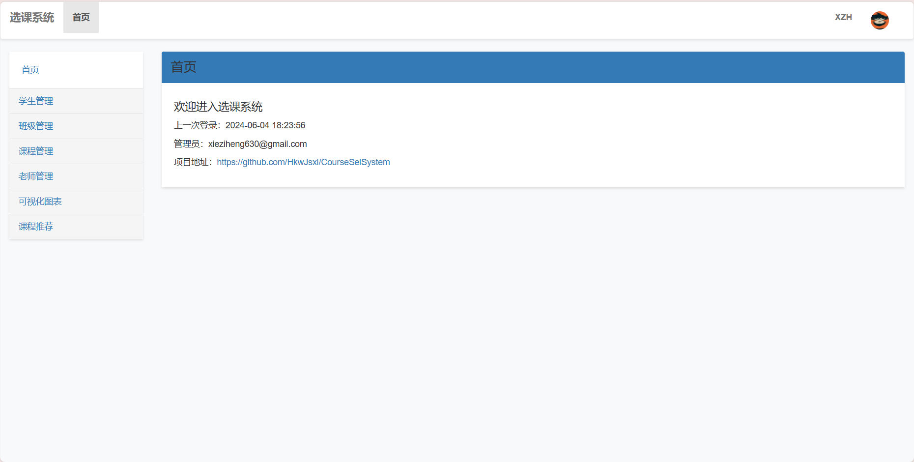
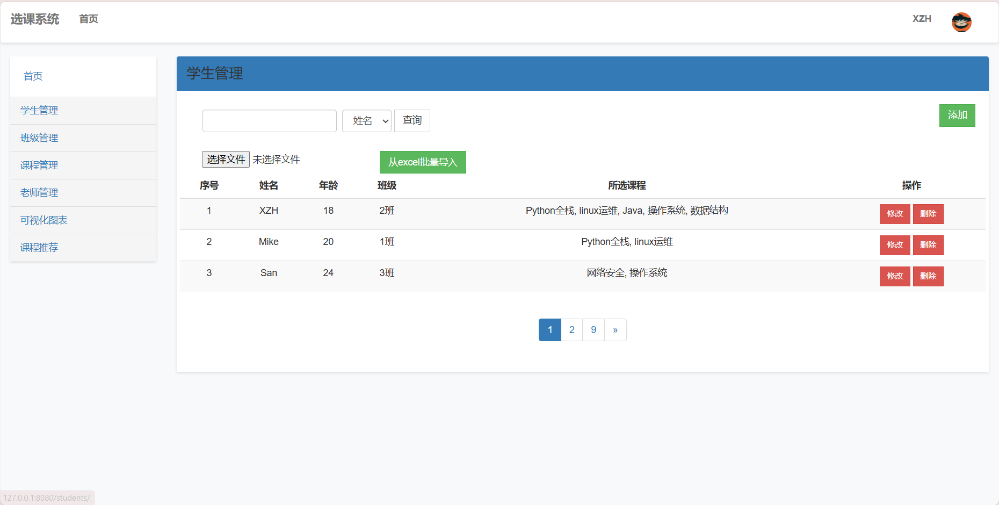
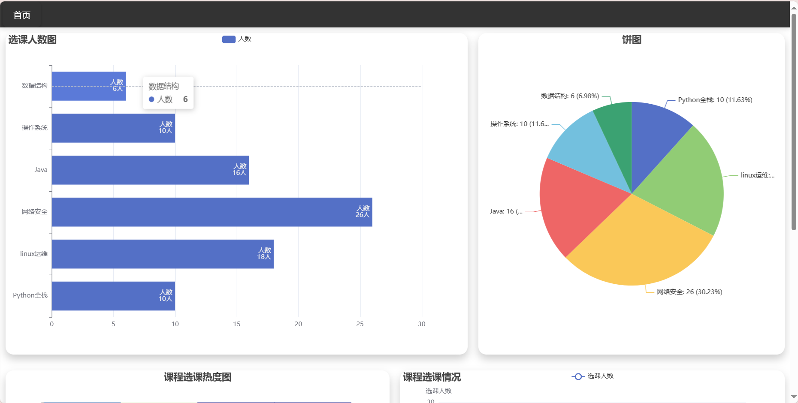
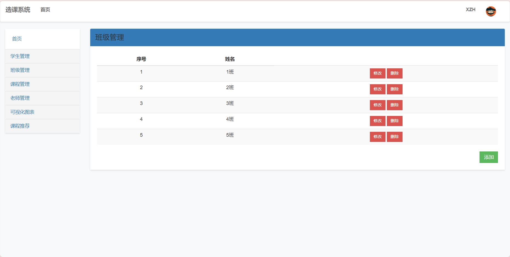
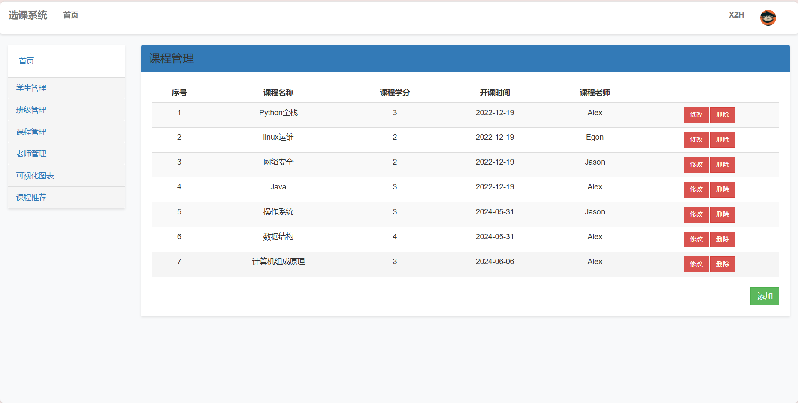
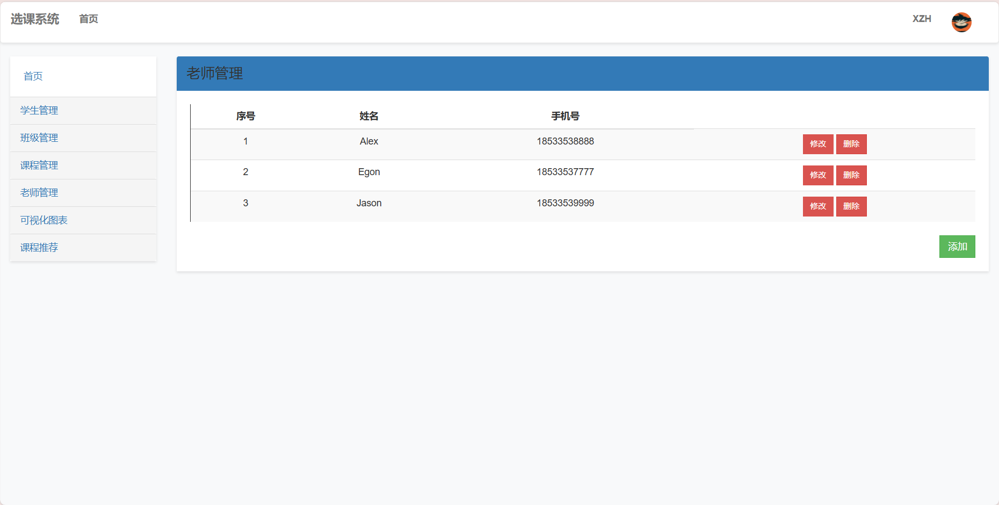
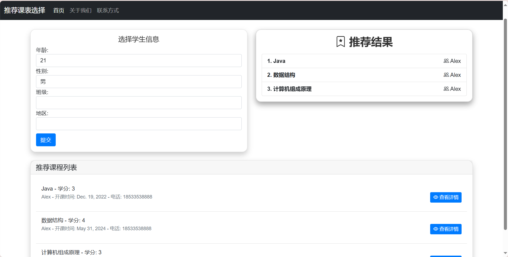
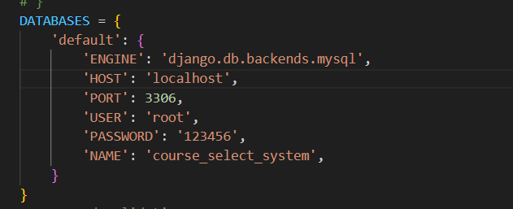

# Django大作业---学生选课系统

## 环境

~~~python
Python            3.9.19
asgiref           3.8.1
Django            4.1
et-xmlfile        1.1.0
joblib            1.4.2
numpy             1.26.4
openpyxl          3.1.3
pillow            10.3.0
pip               24.0
PyMySQL           1.1.1
scikit-learn      1.5.0
scipy             1.13.1
setuptools        69.5.1
sqlparse          0.5.0
threadpoolctl     3.5.0
typing_extensions 4.12.1
tzdata            2024.1
wheel             0.43.0
~~~

## 登录用户

~~~python
账号：XZH 密码：123456
~~~

数据库文件：
数据库：MySQL
根目录下：course_select_system.sql

## 效果

